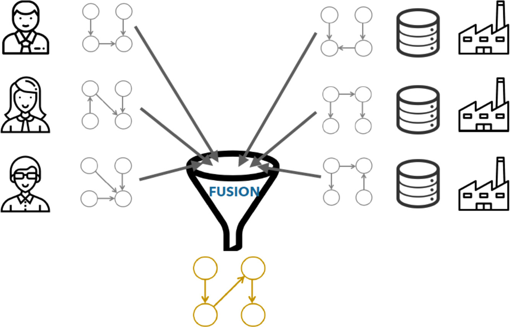

# consensusBN - Bayesian Network Fusion Library

[](https://github.com/UCLM-SIMD/consensusBN/actions/workflows/ci.yml)


[](LICENSE)

## 🧠 Overview

`consensusBN` is a Java-based library for Bayesian Network Fusion. This project allows users to combine multiple Bayesian networks into a single consensus network, leveraging the power of consensus-based modeling techniques. The project is supported by a published paper [(link)](https://www.sciencedirect.com/science/article/abs/pii/S156625352030364X), titled "Efficient and accurate structural fusion of Bayesian networks."



## 🚀 Features

- 🔀 Merge multiple Bayesian networks into a single consensus structure.
- 📄 Support for BIF, XML, JSON formats.
- ⚙️ Customizable fusion strategies (e.g., Union, BES).
- 🧪 Includes tests and reproducible examples.

---

## 📦 Installation

### Requirements

- Java 17 or higher
- Maven 3.6 or higher

### Installation
You can include `consensusBN` to your Maven project by adding the following dependency to your `pom.xml`:
```xml
<dependency>
    <groupId>io.github.jlaborda</groupId>
    <artifactId>consensusBN</artifactId>
    <version>1.0.1</version>
</dependency>
```

### Usage
```

import es.uclm.i3a.simd.consensusBN.*

public class MyBNFusionApp {
    public static void main(String[] args) {
        // Creating list of shared nodes
        ArrayList<Node> sharedNodes = new ArrayList<>();
        for (int i = 0; i < numVariables; i++) {
            Node node = new GraphNode("Node" + i);
            sharedNodes.add(node);
        }
        // Setting seed
        RandomUtil.getInstance().setSeed(42);

        // Generating random DAGs
        for (int i = 0; i < sizeRandomDags; i++) {
            Dag randomDag = RandomGraph.randomDag(sharedNodes,0,50,19,19,19,true);
            randomDagsList.add(randomDag);
        }
        
        // Applying ConsensusUnion
        ConsensusUnion conDag = new ConsensusUnion(randomDagsList);
        ConsensusBES conBES = new ConsensusBES(randomDagsList);
        Graph gUnion = conDag.union();
        Graph gBES = conBES.fusion();

        System.out.println("Union: \n" + gUnion);
        System.out.println("BES: \n" + gUnion);
    }
}
```

## 📚  Documentation

Documentation will be available soon in the [Documentation](docs/) directory.
Stay tuned for:
- API reference
- Use-case examples
- Integration tips

## 🤝 Contributing

We welcome contributions! If you'd like to contribute to `consensusBN`, please follow our [Contribution Guidelines](CONTRIBUTING.md).

## 📝 License

This project is licensed under the MIT License - see the [LICENSE](LICENSE) file for details.

## 🙌 Acknowledgments

- The authors of the original paper: José Miguel Puerta, Juan Ángel Aledo, José Antonio Gámez and Jorge D. Laborda
- [Tetrad project](www.phil.cmu.edu/tetrad)  

## Contact

For questions, suggestions, or feedback, please create an issue.

